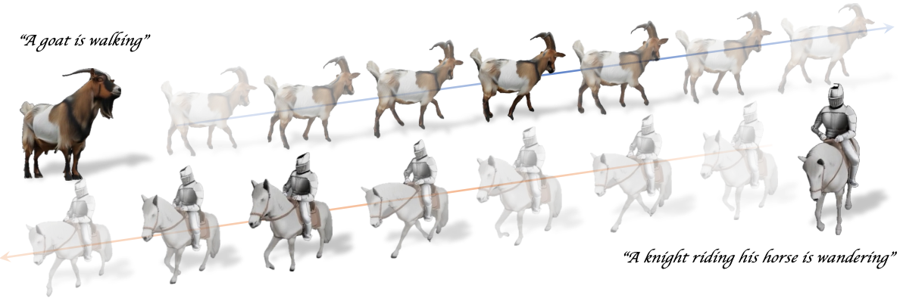
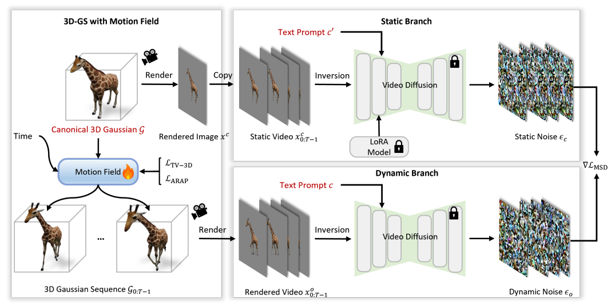

# Animus3D: Text-driven 3D Animation via Motion Score Distillation



### [Project Page](https://qiisun.github.io/animus3d_page/) | [Paper (ArXiv)](https://arxiv.org/abs/2512.12534) | [Supplemental Material]()

**This repository will contain the implementation of SIGGRAPH Asia paper, *Animus3D: Text-driven 3D Animation via Motion Score Distillation*.**

[Qi Sun]()<sup>1</sup>,
[Can Wang]()<sup>1</sup>,
[Jiaxiang Shang]()<sup>2</sup>,
[Wensen Feng]()<sup>2</sup>,
[Jing Liao](https://liaojing.github.io/html/index.html)<sup>1</sup><br>
<sup>1</sup>City University of Hong Kong, <sup>2</sup>Central Media Technology Institute, Huawei

## :star2: Pipeline



### Citation

```
@inproceedings{sun2025animus3d,
author = {Sun, Qi and Wang, Can and Shang, Jiaxiang and Feng, Wensen and Liao, Jing},
title = {Animus3D: Text-driven 3D Animation via Motion Score Distillation},
year = {2025},
booktitle = {Proceedings of the SIGGRAPH Asia 2025 Conference Papers},
}
```
